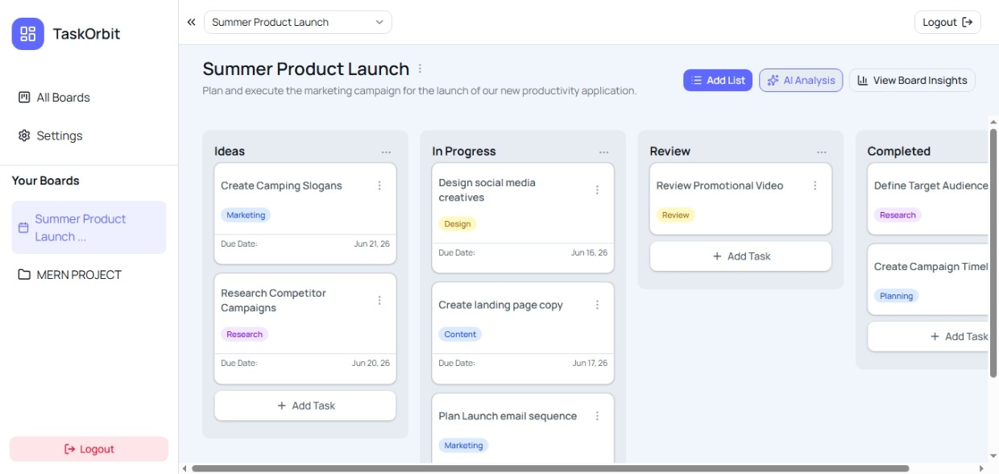
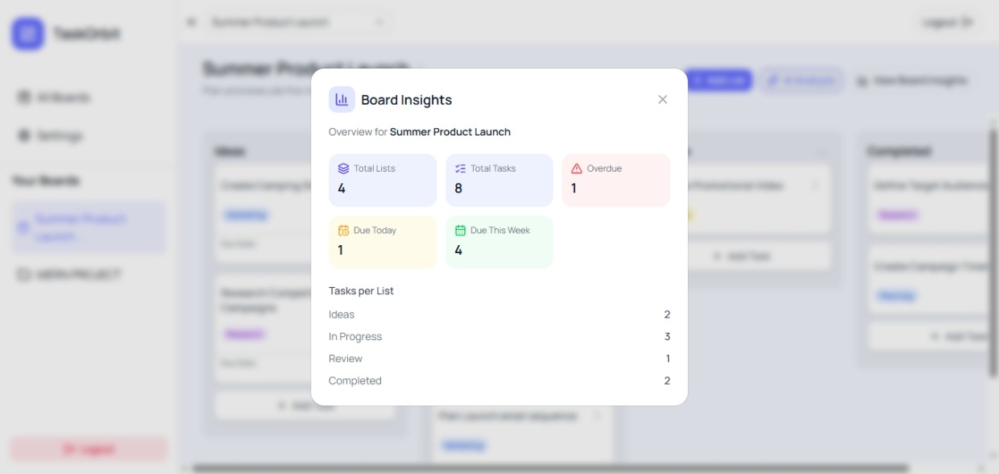
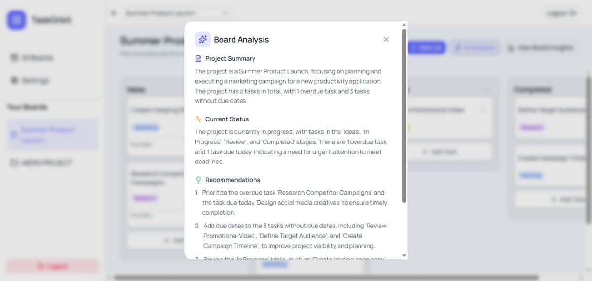
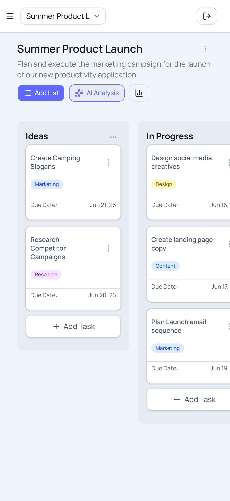
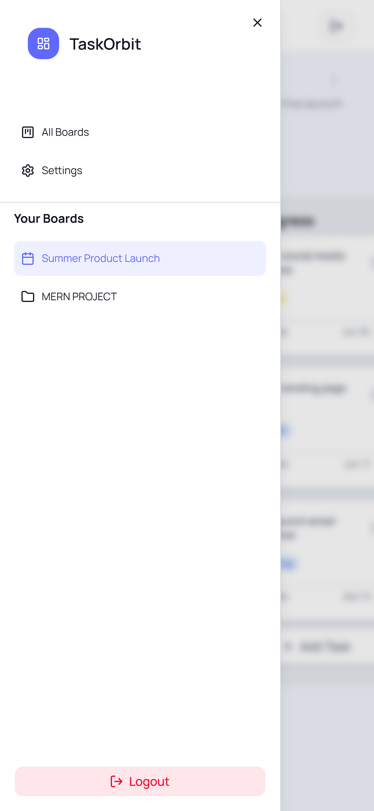

# Task Orbit

Task Orbit is a modern project management platform built with the MERN stack. It helps users organize work using boards, lists, and tasks, track project progress through actionable insights, and leverage AI-generated analysis and recommendations for better planning and execution.

## Screenshots

<h3>Board Management</h3>

  

<h3>Project Insights & AI Analysis</h3>

  
  

<h3>Mobile Experience</h3>

  
  

## Features

### Authentication & Security

- Secure JWT-based authentication
- Email verification
- Forgot password functionality
- Password reset via email
- Change password support
- Protected routes and API endpoints

### Board Management

- Create and manage multiple boards
- Add optional board descriptions
- View all boards in a centralized dashboard
- Update and delete boards

### Task Management

- Create, update, and delete lists
- Create, update, and delete tasks
- Drag-and-drop task management
- Due date support
- Task labels for categorization
- Optional task descriptions

### Board Insights

Automatically generated project metrics including:

- Total lists
- Total tasks
- Overdue tasks
- Tasks due today
- Tasks due this week
- Task distribution across lists

### AI-Powered Analysis

Integrated with Groq AI to provide:

- Project Summary
- Current Project Status
- Actionable Recommendations
- Task prioritization suggestions
- Deadline and planning insights

### Responsive Design

- Mobile-friendly interface
- Optimized layouts for tablets and desktops
- Collapsible navigation sidebar

## Tech Stack

### Frontend

- React
- TypeScript
- Vite
- Tailwind CSS
- Shadcn UI
- React Router
- Axios
- Hello Pangea DnD

### Backend

- Node.js
- Express.js
- MongoDB
- Mongoose
- JWT Authentication

### AI Integration

- Groq API

### Deployment

- Frontend: Vercel
- Backend: Render
- Database: MongoDB Atlas

## Key Highlights

- Built a full-stack AI-powered project management application from scratch.
- Implemented secure authentication with email verification and password recovery.
- Developed a drag-and-drop board system for task organization.
- Created project analytics and insight generation features.
- Integrated AI-powered board analysis using Groq LLM APIs.
- Designed a responsive user experience across desktop and mobile devices.
- Deployed a production-ready application using modern cloud platforms.
